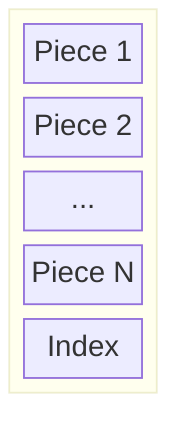
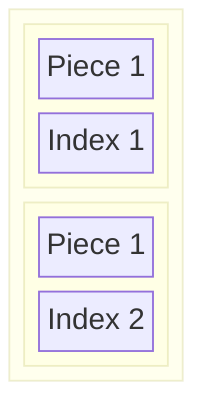
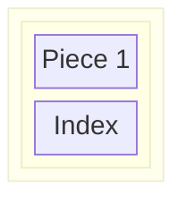

# Structure
A Pokitomo file contains a number of chunks.
Each chunk contains one or more pieces of data, and ends with an index, telling the software where those pieces are located in the file.

## Piece
## Index
## Chunk

## Multiple chunks in a file

# Examples
## A minimal file

