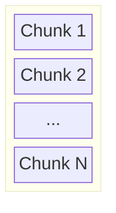
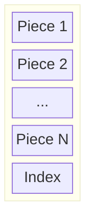
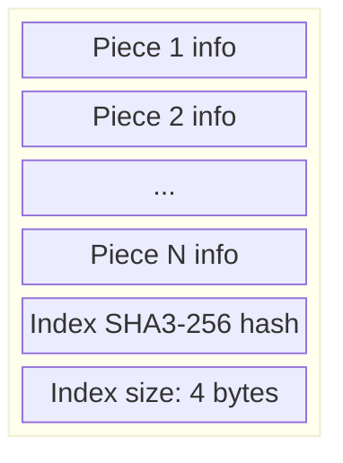
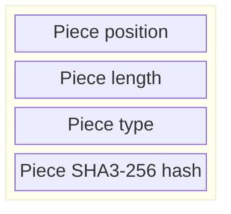
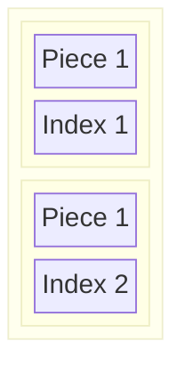
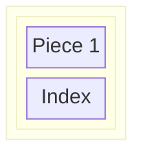
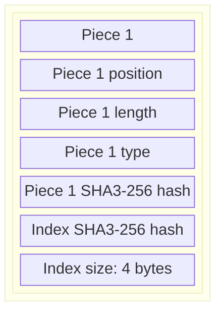
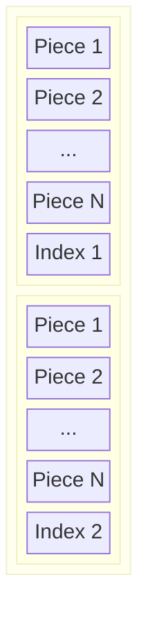

# Structure
A Pokitomo file contains a number of chunks.
Each chunk contains one or more pieces of data, and ends with an index, telling the software where those pieces are located in the file.

# A Pokitomo file

## Chunk
Each chunk has one or more pieces. Each piece contains some data that the user stores.
Each chunk ends with an index that keeps track of where each piece is in the file.

## Piece
Just a blob of binary data. Position and length is stored in the index.

## Index

The index hash depends on:
- Each piece hash
- Each piece position
- Each piece length
- Each piece type

## Piece info

Piece type is one of:
- Binary blob
- Key-value pairs

The piece hash is the SHA3-256 hash of the binary data in the piece.

## Multiple chunks in a file

A sidenote is that each piece is indexed in its own chunk. That is, there are two "Piece 1" in the above file,
because each is index 1 in their own chunk.

# Examples
## A minimal file

## The same minimal file with all pieces written out

## A Pokitomo file with two chunks

